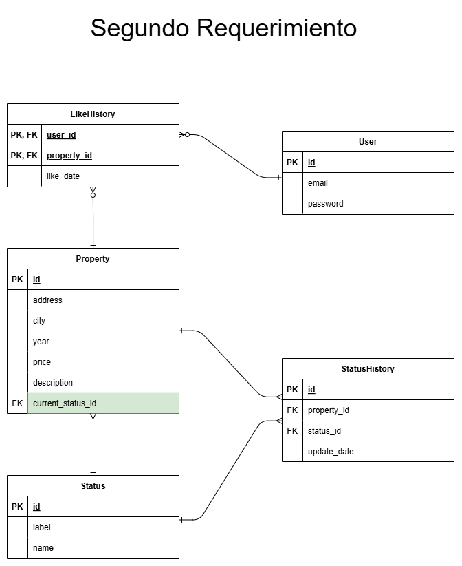

# Prueba técnica para el puesto de desarrollador backend en Habi

Esta prueba consiste en desarrollar un microservicio REST para consultar información de inmuebles almacenados en una base de datos MySQL. El desarrollo se realiza completamente en Python nativo, sin frameworks ni ORMs, siguiendo la metodología TDD (Test-Driven Development).

## Tecnologías utilizadas y enfoque del desarrollo

### Tecnologías utilizadas

- Python 3.9+

- MySQL (conexión directa mediante mysql-connector-python)

- unittest (para pruebas unitarias)
  
- dotenv (para manejo de configuración de las variables de entorno)
  
- PEP8 como guía de estilo
  
 - Sin uso de frameworks web o ORMs

### Enfoque de desarrollo 

Este proyecto se desarrollará siguiendo TDD (Test-Driven Development). Esto significa que:

1. Se escribirá primero una prueba unitaria que refleje el comportamiento deseado.

2. Luego se desarrollará el código mínimo necesario para que la prueba pase.

3. Finalmente se refactorizará el código manteniendo las pruebas verdes.

### Estructura del proyecto
```
habi-prueba-tecnica/
├── src/
│   ├── api/               # Servidor REST para el API del MS
│   ├── database/          # Conexión a la base de datos
│   ├── models/            # Clases que representan entidades del dominio
│   ├── services/          # Lógica de negocio
├── tests/                 # Pruebas unitarias
├── docs/                  # Documentación y archivos SQL correpondientes al microservicio de "Me gusta"
└── .env
└── .gitignore
└── README.md
└── requirements.txt
```

# Servicio de "consulta"

Este microservicio expone un endpoint REST que permite consultar inmuebles disponibles en la base de datos. Los datos se obtienen directamente de una base MySQL mediante SQL nativo (sin ORM) y se filtran según el último estado registrado del inmueble.

## Funcionalidades implementadas

- Consulta de propiedades cuyo último estado sea `pre_venta`, `en_venta` o `vendido`
- Filtro opcional por:
  - Año de construcción (`year`)
  - Ciudad (`city`)
  - Estado actual (`status`)
- Combinación de múltiples filtros en una misma consulta
- Validaciones de entrada para cada filtro
- Respuestas consistentes en formato JSON
- Manejo de errores con códigos HTTP apropiados
- Endpoint `/health` para verificación de salud del servicio

## Endpoint REST

### `GET /properties`

Devuelve una lista de propiedades visibles, opcionalmente filtradas.

**Parámetros de query:**
| Parámetro | Tipo     | Descripción                                       |
|-----------|----------|---------------------------------------------------|
| `year`    | int      | Año de construcción de la propiedad               |
| `city`    | string   | Ciudad exacta (ejemplo: `bogota`)                |
| `status`  | string   | Uno de: `pre_venta`, `en_venta`, `vendido`       |

Cabe aclarar que a pesar de que en `docs/filters.json` está los posibles filtros, este archivo es de mera información y no tiene ningún propósito de prueba, todos los filtros son tratados a través de parámetros.


#### **Ejemplos de uso:**


`/properties`


`/properties?city=bogota`


`/properties?year=2020&status=pre_venta`


`/properties?status=en_venta&year=2020&city=pereira`


Errores posibles:

| Error| Motivo | 
|----------|----------|
| 400    | Filtro inválido o valor no permitido   |
| 404    | Endpoint no encontrado   |
| 500    | Error interno del servidor   |

### Pruebas 
El microservicio fue desarrollado completamente con TDD. Las pruebas unitarias cubren:

- Filtros individuales (year, city, status)

- Filtros combinados

- Validación del contenido y estructura de las propiedades

- Las pruebas están ubicadas en la carpeta `tests/`.

### Colecciones de Postman
Se incluye una colección de Postman en `collections/` para facilitar el consumo y prueba del microservicio. Puede ser importada directamente desde la aplicación Postman.

### Ejecución del proyecto
A continuación se explican los pasos necesarios para correr el microservicio localmente, así como ejecutar las pruebas unitarias.

#### 1. Clonar el repositorio

```bash
git clone https://github.com/SantiagoOso02/habi-prueba-tecnica
cd habi-prueba-tecnica
```

#### 2. Crear y activar el entorno virtual

```
python -m venv .venv
source .venv/bin/activate  # En Linux/macOS
.venv\Scripts\activate     # En Windows
```

#### 3. Instalar dependencias

```
pip install -r requirements.txt
```

#### 4. Configurar variables de entorno
Crea un archivo .env en la raíz del proyecto con el siguiente contenido (usando las credenciales de la base de datos proporcionadas):

```
DB_HOST=...
DB_PORT=...
DB_USER=...
DB_PASSWORD=...
DB_NAME=...
```

#### 5. Ejecutar pruebas unitarias
Desde la raíz del proyecto:

```
python -m tests.test_property_service
```


#### 6. Iniciar el servidor REST
Desde la raíz del proyecto:

```
python src.api.server
```

Por último, para probar los endpoints directamente desde Postman o tu navegador.

`GET /properties`

`GET /properties?city=bogota&year=2020`

`GET /health (para verificar que el servicio está activo)`


# Servicio de "Me gusta"
Este segundo microservicio es conceptual y no requiere implementación en código. Su objetivo es modelar la funcionalidad que permite a los usuarios registrados darle "me gusta" a propiedades y mantener un historial de dichas acciones.

## Requerimientos funcionales

- Un usuario puede darle "me gusta" a un inmueble en específico.
- Cada "me gusta" debe ser registrado junto con la fecha en que se dio.
- Se debe mantener un historial de qué usuario dio "me gusta" a qué inmueble.
- No se permite que un mismo usuario le dé "me gusta" varias veces a la misma propiedad.

---

## Propuesta de modelo E/R

El modelo antes de este microservicio era el siguiente:


Luego de añadir lo necesario para cumplir con los requerimientos del segundo microservicio este es el resultado final


Ambos diagramas se encuentran en la carpeta `docs/`


## Justificación del modelo

- Se creó una nueva tabla `User` para representar a los usuarios registrados.
- Se añadió una tabla `LikeHistory` que representa una relación **muchos a muchos** entre usuarios e inmuebles (`Property`), con un campo adicional `like_date` para almacenar la fecha y hora en que se dio el "me gusta".
- La **clave primaria compuesta** `(user_id, property_id)` garantiza que un usuario no pueda dar "me gusta" al mismo inmueble más de una vez.
- Las relaciones están normalizadas y no hay datos redundantes.

---

### SQL para extender el modelo

El código SQL para extender esta parte del modelo se encuentra en el archivo `docs/ms2.sql`.


# Puntos extra

## Punto 1. TDD

Todo el desarrollo del microservicio de consulta fue realizado siguiendo la metodología **TDD (Test-Driven Development)**.  
Cada funcionalidad se implementó de forma incremental, comenzando con la escritura de pruebas unitarias que definían el comportamiento esperado del sistema, seguidas de la implementación del código mínimo necesario para que dichas pruebas pasaran. Finalmente, se realizaron refactorizaciones conservando las pruebas en verde.

Este enfoque permitió garantizar una mayor confiabilidad, cobertura de pruebas y calidad del código entregado.

## Punto 2. Propuesta para mejorar rendimiento en la base de datos


Con base en el análisis del modelo original y los requerimientos funcionales del microservicio de consulta y me gusta, se identificó una oportunidad clara para mejorar el rendimiento de las consultas, especialmente aquellas relacionadas con el estado actual de los inmuebles.

#### Problema identificado

En el modelo inicial, para conocer el estado actual de un inmueble se requiere una subconsulta sobre `status_history`, combinada con un `JOIN` y un `GROUP BY`.


Este tipo de consultas escala mal en volumen y es costoso a nivel de CPU, especialmente si se ejecuta frecuentemente.


### Solución propuesta

Se propone desnormalizar parcialmente el modelo agregando un campo directo en la tabla property.

```
ALTER TABLE property
ADD COLUMN current_status_id INT,
ADD CONSTRAINT fk_property_current_status
    FOREIGN KEY (current_status_id) REFERENCES status(id);
```

Este nuevo campo se sincroniza cada vez que cambia el estado de una propiedad (vía aplicación o trigger) y permite eliminar el JOIN con status_history al consultar el estado actual de manera directa.


#### Nuevo Diagrama E/R



Se añade una relación directa de property a status, manteniendo la relación muchos-a-muchos con status_history para conservar el historial.


#### Beneficios de la propuesta

- Reducción drástica del tiempo de respuesta en consultas frecuentes

- Eliminación de subconsultas y agregaciones costosas

- Simplificación de la lógica SQL

- Mantenimiento de la trazabilidad histórica con status_history

- Integridad referencial asegurada mediante FOREIGN KEY


#### Justificación técnica

Si bien esta modificación rompe parcialmente la Tercera Forma Normal (3FN), se trata de una desnormalización controlada, que es una práctica común y aceptada cuando el rendimiento de lectura es prioritario. La integridad del dato se conserva al garantizar sincronización entre status_history y property.current_status_id.


#### Conclusión

Esta propuesta busca balancear entre rendimiento, simplicidad de consulta y preservación de integridad del modelo de datos, aportando valor especialmente en entornos de alta concurrencia o grandes volúmenes.
